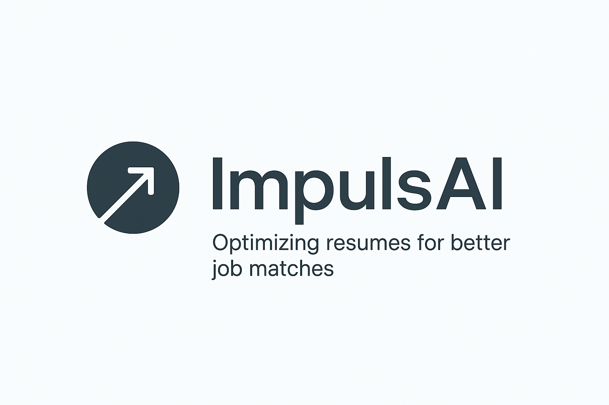

  <figure>
    
  </figure>

## ImpulsAI: o seu assistente inteligente para otimizar currículos e conquistar vagas.
### O Problema
---
Candidatos frequentemente perdem oportunidades valiosas porque seus currículos não estão otimizados para a vaga específica. A triagem inicial, realizada tanto por recrutadores quanto por sistemas automatizados (ATS - Applicant Tracking Systems), pode descartar currículos por falta de alinhamento com palavras-chave, formatação inadequada ou ausência de informações relevantes.

### A solução
---
O ImpulsAI democratiza o acesso a recursos avançados de IA, eliminando a necessidade de o usuário ter conhecimento prévio em _prompt engineering_ ou em LLMs (Large Language Models) para otimizar seu documento. A importância de nossa solução reside em nivelar o campo de jogo, garantindo que o potencial do candidato seja avaliado de forma justa e não seja descartado prematuramente devido a um currículo desatualizado ou não direcionado.

> O ImpulsAI é uma plataforma de software como serviço (SaaS) que utiliza um motor de agentes inteligentes para analisar a descrição da vaga e o currículo do usuário. A ferramenta não se limita a um simples gerador de texto, mas oferece uma solução completa para a preparação do candidato.

A plataforma entrega um pacote de outputs estruturados, que incluem:

* **Customização Inteligente do Currículo:** Sugestões precisas de palavras-chave, habilidades e ajustes de conteúdo para otimizar o currículo para a vaga.

* **Guia de Preparação para Entrevistas:** Um roteiro com perguntas e respostas-modelo para entrevistas de fit cultural e técnico, baseado nos requisitos da posição.

* **Roadmaps de Aprendizado:** Sugestões de cursos e trilhas de estudo para que o candidato possa preencher lacunas de conhecimento e se preparar tecnicamente para a vaga.

### Desafios Enfrentados
---
Durante o desenvolvimento do projeto, a equipe se deparou com desafios técnicos e de negócio significativos. Um dos principais obstáculos técnicos foi a implementação de um sistema robusto de web scraping para a coleta de dados de vagas de emprego. Em um primeiro momento a estratégia para contornar este desafio foi a criação de uma base de dados estática (`vagas.json`e `cursos.json`), permitindo que a funcionalidade principal de análise e otimização fosse validada. Posteriormente, criou-se uma API para viabilizar o web scrapping e, consequentemente, um MVP com mais qualidade. Ainda no contexto técnico, outro desafio encontrado foi a orquestação das fases, uma vez que cada fase depende diretamente da qualidade da anterior então criou-se uma cadeia de dependências que tinha que funcionar de forma robusta, consustente e com com qualidade.

A nível de negócio, o desafio mais notável foi a diferenciação do produto em um mercado dominado por concorrentes de peso como o Gemini e o ChatGPT. A superação desse desafio se deu ao focar na proposta de valor única do ImpulsAI: a especialização no problema de triagem de currículos, a abstração da complexidade da IA e a entrega de uma solução completa de preparação de carreira, indo além da simples geração de texto.

### Decisões Técnicas, de Design e seus _trade-offs_
---
O projeto foi concebido com o auxílio de inteligência artificial e _prompt engineering_, que atuou como uma ferramenta de apoio e não como um agente resolvedor único. Essa abordagem ética garantiu que as decisões estratégicas fossem tomadas pela equipe, com a IA acelerando a documentação e a prototipação. Para mais detalhes, consultar a [Documentação Técnica](docs/technical_doc.md).

#### Principais decisões técnicas:
* **Criação de API própria para o web scrapping:** O desenvolvimento de uma API própria para viabilização do web-scrapping, apesar de ter sido custosa, foi essencial para agregar mais valor técnico ao MVP. 

* **Metodologia BDD:** A adoção do BDD (Behavior-Driven Development) para a escrita de requisitos e casos de teste se mostrou crucial. Essa decisão garante que o foco esteja sempre no valor para o usuário, alinhando as equipes e tornando a comunicação mais eficaz.

* **Armazenamento de Dados:** A decisão de utilizar arquivos JSON estáticos para o MVP foi um trade-off consciente para acelerar o desenvolvimento, evitando a complexidade inicial de um banco de dados relacional ou NoSQL.

* **Transição de arquitetura monolítica para Client-Server com BackEnd Desacoplado:** A transição no modelo de arquitetura foi um passo elementar para viabilização técnica do MVP e integração com a API desenvolvida.

### Aprendizados e próximos passos
---
O desenvolvimento desta versão inicial nos permitiu analisar e validar a melhor arquitetura técnica para nosso projeto. A adoção da metodologia BDD (Behavior-Driven Development) nos ensinou a manter o foco no valor para o usuário, garantindo que o escopo seja gerenciável, que a qualidade do produto seja a prioridade e que existe diferenciação em um mercado tão competitivo. Para além disso, outra lição valiosa foi o entendimento da importância da documentação técnica, escrita previamente, como guideline para desenvolvimento e artefato de suporte para tomada de decisões técnicas e de negócio.

**Para os próximos passos, planejamos expandir as funcionalidades do projeto, considerando os seguintes pontos que estão fora do escopo atual:**

* Adicionar suporte para a criação de currículos do zero, a partir de formulários.

* Integrar a plataforma com APIs de emprego para busca automatizada de vagas.

* Desenvolver um dashboard para acompanhamento de candidaturas.

* Suporte a múltiplos idiomas.

### Nosso Time
---
Nosso time é composto por profissionais com diferentes níveis de experiência e background técnico, cada um com aptidão para diferentes áreas. Dessa maneira, compõe-se a _sinfonia_ perfeita entre desenvolvimento, dados e negócios.

* **Ithalo Araujo** (iras@cin.ufpe.br) atuou como Gerente de Produtos, realizando atividades de análise de negócio, análise e especificação de requisitos, elaboração de documentação técnica, diagramas, apresentação e relatórios.
* **Maria Eduarda de Lima** (melg@cin.ufpe.br) atuou como Desenvolvedora e Engenheira de Dados, propondo e implementação processos de ETL, criação de API para web scrapping implantação de pipelines de CI/CD.
* **Rafael Moura** (rnm4@cin.ufpe.br) atuou como Desenvolvedor, sendo responsável pelo front-end e back-end da aplicação.

### Como Contribuir
---
O _ImpulsAI_ é um projeto de código aberto e colaborativo. **Contribuições são sempre bem-vindas**, seja através de sugestões de melhoria, relato de bugs ou novas funcionalidades. Para mais detalhes, por favor, consulte o nosso [guia de contribuição](docs/contribute.md) ou abra uma issue no repositório.

### Como Buildar
---
Para configurar e rodar o projeto localmente, siga os pré-requisitos e os passos de instalação detalhados no [arquivo de build](docs/build.md). O processo envolve a clonagem do repositório, a instalação das dependências do backend e do frontend, e a inicialização dos dois servidores em terminais separados.

### Links Úteis
---
* [Pitch](): https://docs.google.com/presentation/d/1phDWPOVSU1KECS024X2yv7FsJcmgeZDKwAhK-1YP96k/edit?usp=sharing
* [Relatório Final](): https://docs.google.com/document/d/1lUiZjpNS5G4i2UkEL7y0fX70t2_k2-4sXENNvUUlH0E/edit?usp=sharing
* [Documentação Técnica Completa](docs/technical_doc.md)
* [Artefatos AIDesign](docs/ai_design_artifacts/)
* [Diagramas C4](docs/diagrams/)
* [Prompting](docs/prompt_engineering/)
* API externa: https://github.com/melg88/api-jobs-courses-impulseAI/blob/main/docs/API_CONSUMER_GUIDE.md
