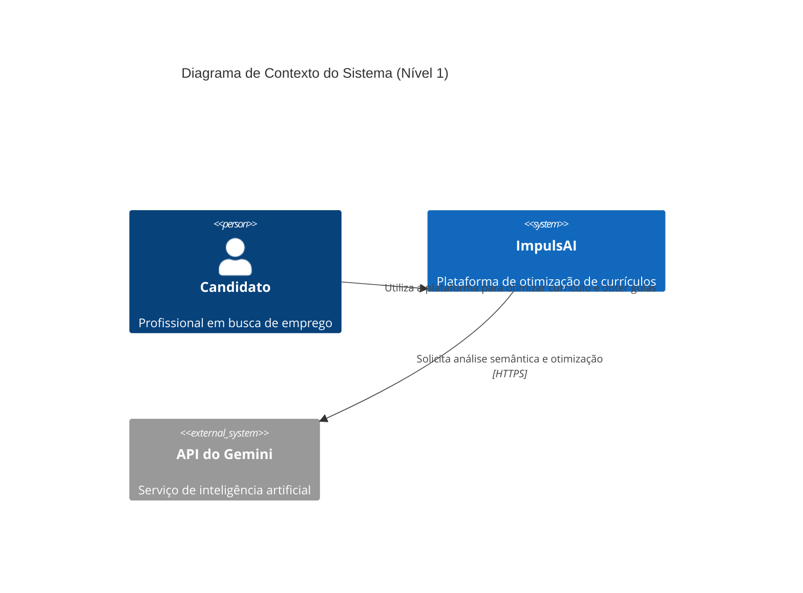
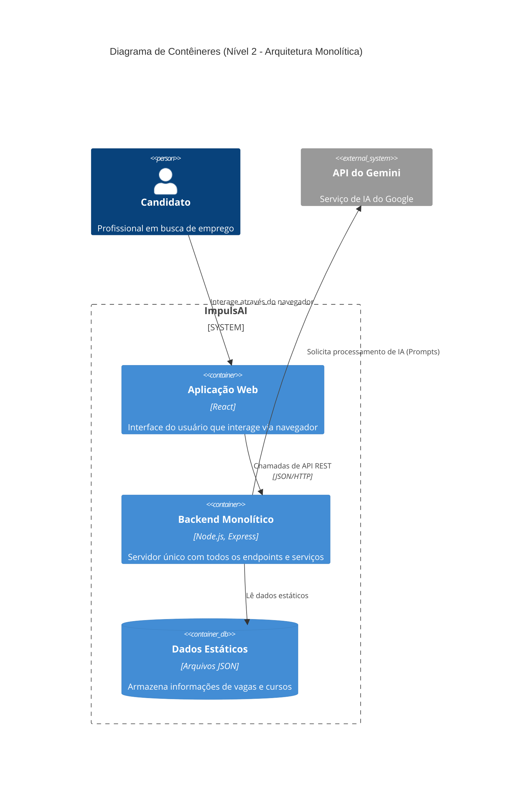
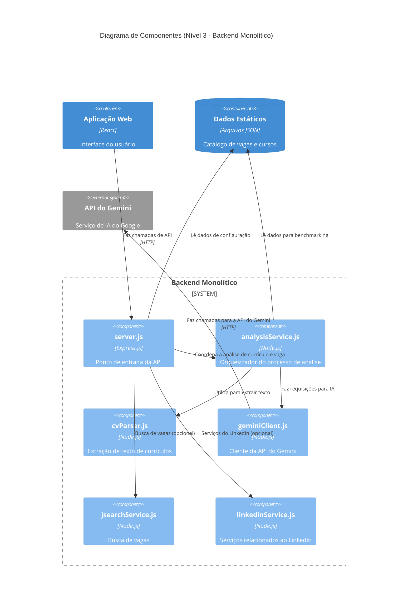

## C4 Diagram - ImpulsAI

### Contexto
---

#### Descrição:

O Candidato é o usuário principal, que interage com o ImpulsAI. O ImpulsAI é o sistema que coordena as informações e fornece a solução. A API do Gemini é um sistema externo essencial que fornece a inteligência artificial para o processamento dos dados.

### Contêiners
---
Este diagrama amplia a visão do sistema ImpulsAI, dividindo-o em seus principais contêineres tecnológicos. Ele detalha a arquitetura monolítica, mostrando como os componentes principais interagem.

Descrição:

* Aplicação Web (Frontend): O contêiner de apresentação, executado no navegador do usuário, responsável pela interface.

* Backend Monolítico: O contêiner que centraliza toda a lógica de negócio, autenticação e orquestração dos serviços.

* Dados Estáticos (Arquivos JSON): O contêiner de persistência, que armazena os dados de referência para o sistema.

* API do Gemini: O contêiner externo que fornece a inteligência artificial.

### Componentes
---
Este diagrama detalha o contêiner Backend Monolítico, exibindo os principais componentes de software, suas responsabilidades e as interações entre eles.

#### Descrição:

* O componente `server.js` é a interface do backend, recebendo as requisições da Aplicação Web.
* O `analysisService.js` orquestra o fluxo de análise, utilizando o `cvParser.js` para extrair o texto do currículo e o `geminiClient.js` para interagir com a inteligência artificial.

* O `geminiClient.js` é um componente-chave que encapsula a comunicação com a API do Gemini externa.

* Os componentes `jsearchService.js` e `linkedinService.js` representam outros serviços modulares que podem ser utilizados pelo servidor principal.

* O `db_json` é acessado internamente pelos serviços para consultar os dados estáticos de vagas e cursos.