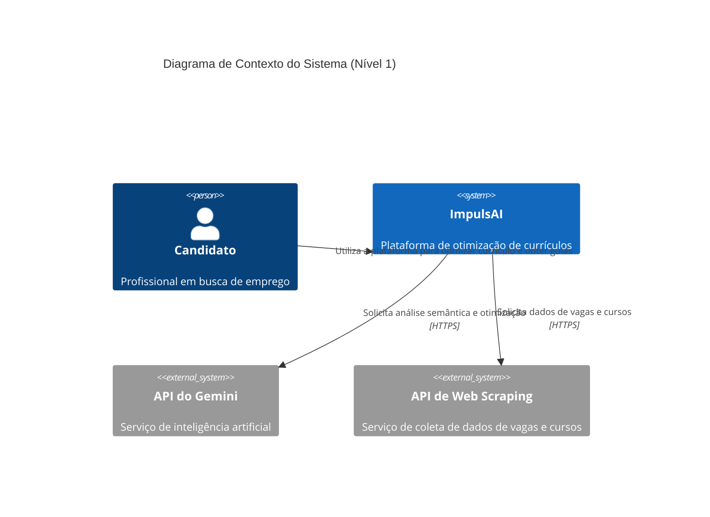
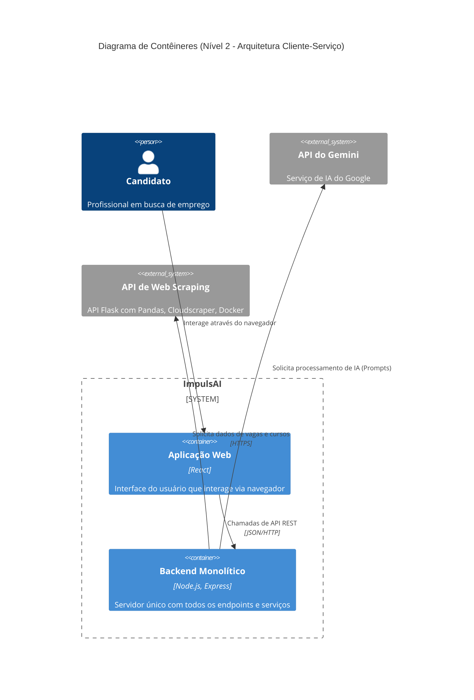
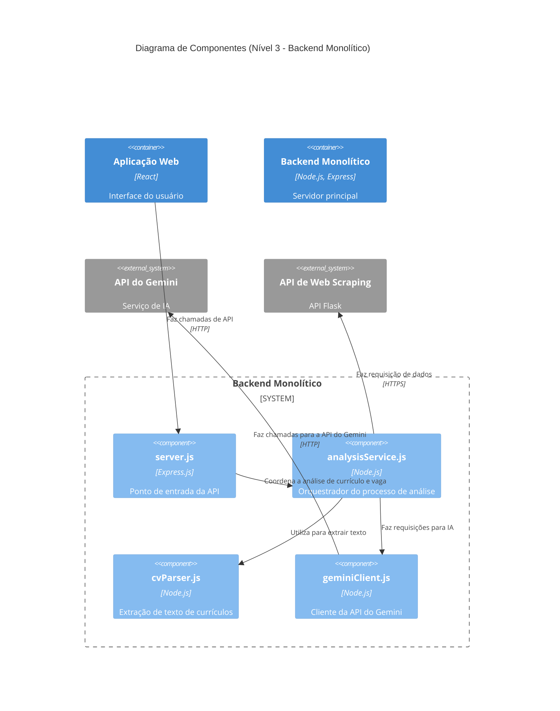

## C4 Diagram - ImpulsAI
Este documento apresenta a arquitetura do ImpulsAI utilizando a notação do Modelo C4, que descreve o sistema em diferentes níveis de abstração. O foco está nos níveis de Contexto, Contêineres e Componentes para fornecer uma visão clara da estrutura e das interações do sistema.

### Nível 1: Diagrama de Contexto do Sistema
---
Este diagrama mostra o ImpulsAI como uma caixa única, ilustrando sua interação com o principal usuário (Candidato) e com os sistemas externos dos quais depende.

#### Descrição
* O Candidato é o usuário principal, que interage com o ImpulsAI.
* O ImpulsAI é o sistema que coordena as informações e fornece a solução.
* A API do Gemini é um sistema externo essencial que fornece a inteligência artificial para o processamento dos dados.
* A API de Web Scraping é um novo sistema externo, implementado em Flask, responsável por coletar dados de vagas e cursos de fontes como LinkedIn, Udemy, Coursera, etc.

### Nível 2: Diagrama de Contêineres
---
Este diagrama amplia a visão do sistema ImpulsAI, dividindo-o em seus principais contêineres tecnológicos. Ele detalha a arquitetura Cliente-Serviço, mostrando como os componentes principais interagem.

#### Descrição
* Aplicação Web (Frontend): O contêiner de apresentação, desacoplado do backend, executado no navegador do usuário e responsável pela interface.
* Backend Monolítico: O contêiner que centraliza a lógica de negócio, autenticação e orquestração dos serviços. Ele é desacoplado do frontend e se comunica com os serviços externos para obter dados.
* API do Gemini: O contêiner externo que fornece a inteligência artificial.
* API de Web Scraping: Um novo contêiner externo, responsável pela coleta de dados. Sua implementação em Flask, com Docker, Nginx e SSL, garante segurança e controle de acesso via API keys.

### Nível 3: Diagrama de Componentes
---
Este diagrama detalha o contêiner Backend Monolítico, exibindo os principais componentes de software, suas responsabilidades e as interações entre eles.

#### Descrição:
* O componente `server.js` é a interface do backend, recebendo as requisições da Aplicação Web.
* O `analysisService.js` orquestra o fluxo de análise, utilizando o `cvParser.js` para extrair o texto do currículo, e faz requisições para a API de Web Scraping para obter dados de vagas e cursos.
* O `gemini_client.js` é um componente-chave que encapsula a comunicação com a API do Gemini externa.